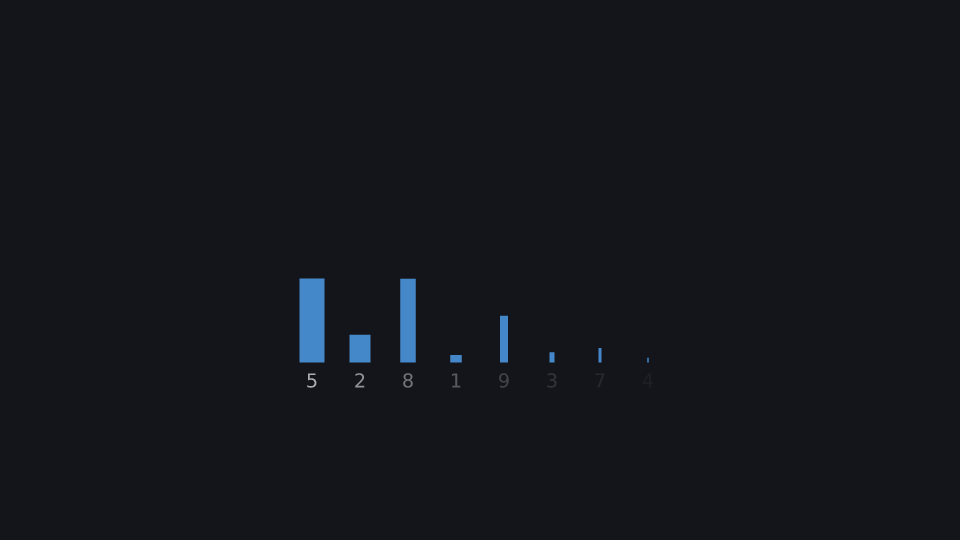
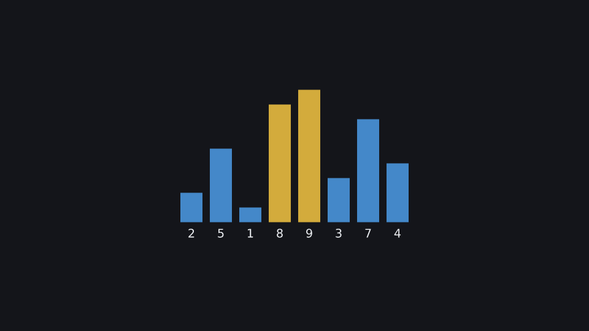
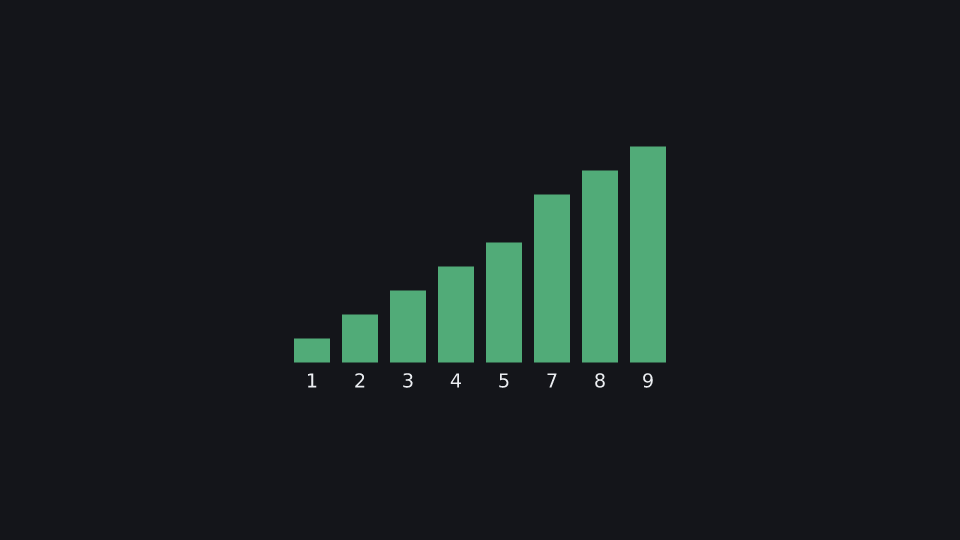

# Bubble sort

Ordinary Python logic in the build phase drives a sorting animation: bars reflow when swapped, comparisons are highlighted with `s.during`, and `s.tempo` accelerates the run.

**Uses:** `k.Bar`, `k.Row`, `Group.swap`, `Scene.during`, `Scene.tempo`, `k.stagger` — see the [API reference](../reference/README.md).

  

Run it: `kinemo dev examples/bubble_sort.py` · render: `kinemo render examples/bubble_sort.py`

```python
import kinemo as k


@k.scene
def bubble_sort(s: k.Scene):
    row = k.Row(*[k.Bar(v, label=True) for v in [5, 2, 8, 1, 9, 3, 7, 4]],
                gap=0.2, align="bottom").place(at="center")
    s.play(k.stagger([k.grow(b, from_="bottom") for b in row], lag=0.05))

    n = len(row)
    with s.tempo(1, to=4):                     # speeds up over the algorithm
        for i in range(n):
            for j in range(n - 1 - i):
                a, b = row[j], row[j + 1]       # positions at the cursor
                with s.during(a.to(color=k.YELLOW), b.to(color=k.YELLOW), duration=0.2):
                    if a.value.now > b.value.now:
                        s.play(row.swap(j, j + 1), duration=0.4)
                    else:
                        s.wait(0.2)
            s.play(row[n - 1 - i].to(color=k.GREEN), duration=0.2)
```
