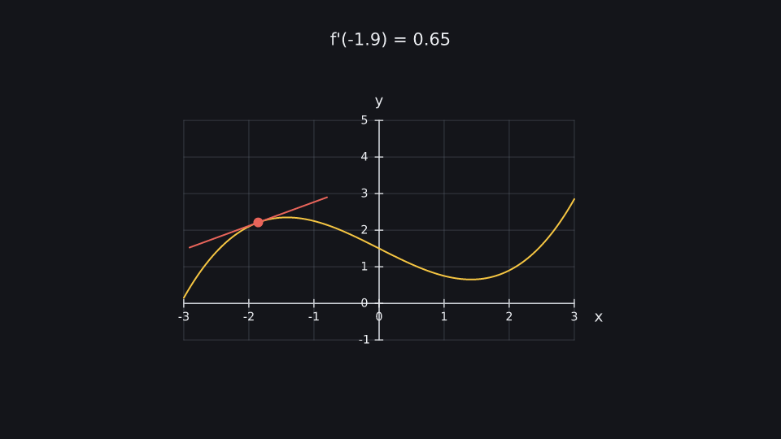
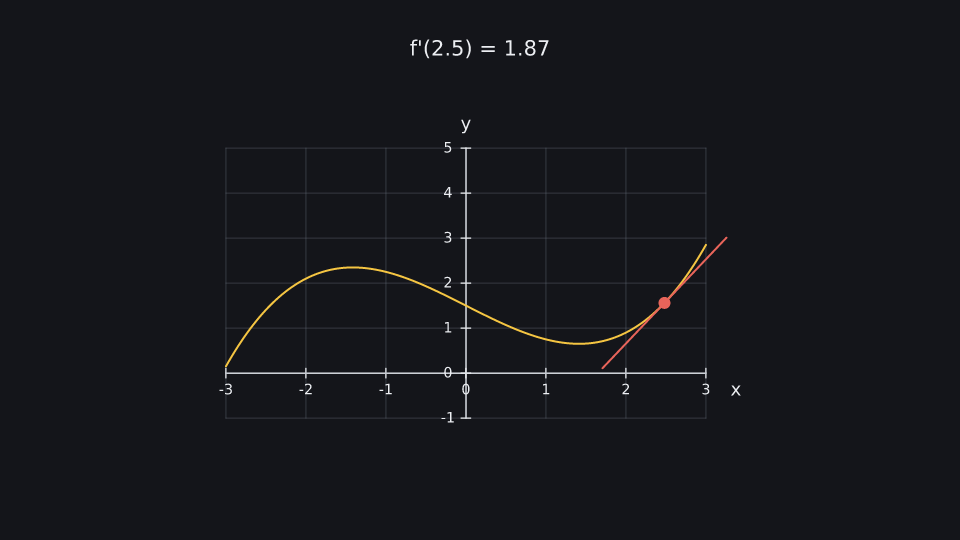
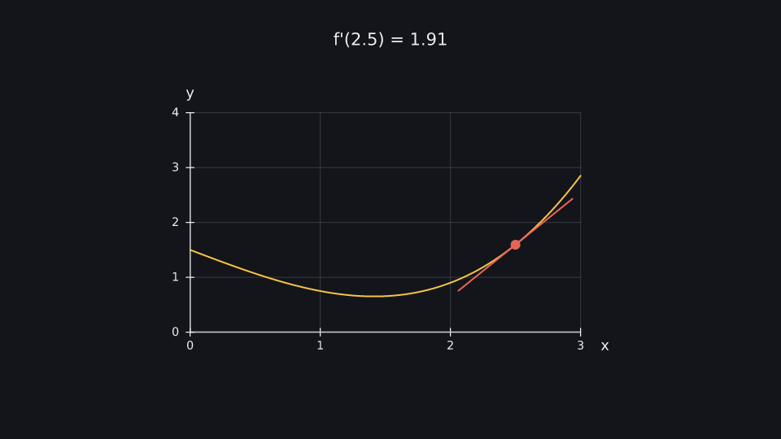

# Derivative

A tangent slides along a curve while a reactive label shows the slope; the axes zoom at the end.

**Uses:** `k.Axes`, `Axes.plot`, `Plot.tangent_at`, `Plot.point_at`, `Axes.zoom_to`, `k.signal` — see the [API reference](../reference/README.md).

  

Run it: `kinemo dev examples/derivative.py` · render: `kinemo render examples/derivative.py`

```python
import kinemo as k


def f(x: float) -> float:
    return 0.15 * x**3 - 0.9 * x + 1.5


@k.scene
def derivative(s: k.Scene):
    ax = k.Axes(x=(-3, 3, 1), y=(-1, 5, 1), grid=True, labels=("x", "y")).place(at="center")
    x = k.signal(-2.0)
    curve = ax.plot(f, color=k.YELLOW)
    dot = k.Dot(r=0.1, fill=k.RED).place(at=curve.point_at(x))
    tan = curve.tangent_at(x, length=3, stroke=k.RED)
    label = k.Text(lambda: f"f'({x():.1f}) = {curve.slope_at(x)():.2f}", size=0.35).place(at="top", margin=0.6)
    s.play(k.draw(ax), k.draw(curve))
    s.play(k.fade_in(dot, tan, label), duration=0.5)
    s.play(x.to(2.5), duration=3)
    s.play(ax.zoom_to(x=(0, 3), y=(0, 4)), duration=1.5)
    s.wait(0.5)
```
