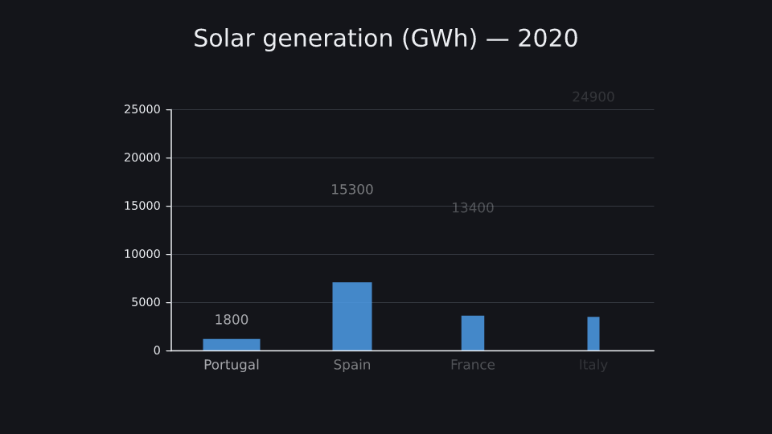
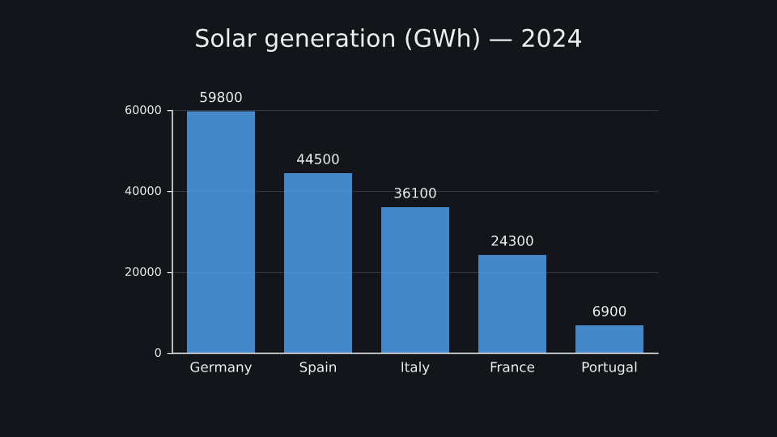

# Energy bar chart

A bar chart built from a polars DataFrame transitions to new data: bars grow, reorder and enter by key.

**Uses:** `k.BarChart`, `BarChart.to` — see the [API reference](../reference/README.md).

 

Run it: `kinemo dev examples/energy.py` · render: `kinemo render examples/energy.py`

```python
"""Solar generation by country: a BarChart that animates the switch between two years of data.

The tables are polars DataFrames; kinemo reads them through the Arrow PyCapsule Interface, with
no copy and without importing polars. Bars grow, swap places, enter and leave by key.
"""

import polars as pl

import kinemo as k

generation_2020 = pl.DataFrame({
    "country": ["Portugal", "Spain", "France", "Italy"],
    "gwh":     [1_800, 15_300, 13_400, 24_900],
})
generation_2024 = pl.DataFrame({
    "country": ["Spain", "Germany", "Italy", "Portugal", "France"],
    "gwh":     [44_500, 59_800, 36_100, 6_900, 24_300],
}).sort("gwh", descending=True)


@k.scene(tail=1.0)
def energy(s: k.Scene):
    title = k.Text("Solar generation (GWh) — 2020", size=0.5).place(at="top", margin=0.5)
    chart = k.BarChart(generation_2020, x="country", y="gwh", key="country", width=10, height=5, grid=True)
    chart.place(below=title, gap=0.6)
    s.play(k.write(title))
    s.play(k.draw(chart), duration=2)
    s.wait(0.5)
    s.play(chart.to(data=generation_2024), title.to(text="Solar generation (GWh) — 2024"), duration=2.5)
    s.play(k.indicate(chart.bar("Germany")))
```
