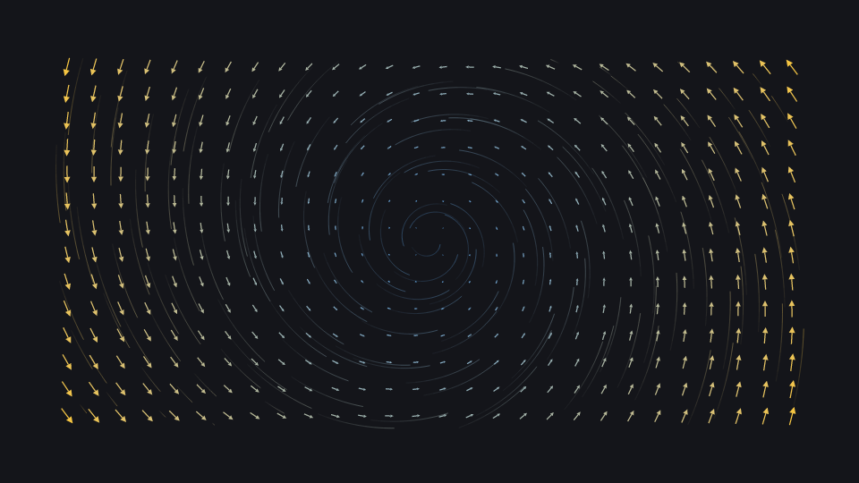
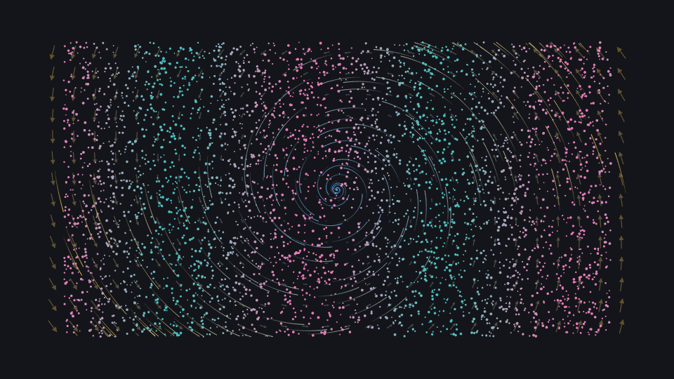

# Vector field

A vector field, animated stream lines and thousands of points with per-point colors, all evaluated natively.

**Uses:** `k.VectorField`, `k.StreamLines`, `k.Points` — see the [API reference](../reference/README.md).

 

Run it: `kinemo dev examples/field.py` · render: `kinemo render examples/field.py`

```python
"""A rotation field with a swirl: arrows, streamlines and particles.

    kinemo check --strict examples/field.py
"""

import numpy as np

import kinemo as k


def swirl(x: float, y: float) -> tuple[float, float]:
    """Rotation around the origin with a slight inward flow."""
    return (-y - 0.2 * x, x - 0.2 * y)


@k.scene
def field(s: k.Scene):
    arrows = k.VectorField(swirl, density=28, length=0.7)
    lines = k.StreamLines(arrows, seeds=160, steps=80, progress=0.0, tail=0.6, fade=0.05)
    rng = np.random.default_rng(7)
    xy = rng.uniform((-6.5, -3.5), (6.5, 3.5), size=(4000, 2))
    particles = k.Points(
        xy,
        radius=lambda p: 0.015 + 0.02 * p.t,
        color=lambda t, p: k.mix(k.TEAL, k.PINK, (k.sin(p.x + t) + 1) / 2),
    )
    s.play(k.draw(arrows), duration=1.5)
    s.play(k.fade_in(lines), lines.to(progress=1.0), duration=3)
    s.play(k.draw(particles), duration=2)
    s.play(arrows.to(opacity=0.35), lines.to(tail=0.25), duration=1.5)
    s.wait(1)
```
