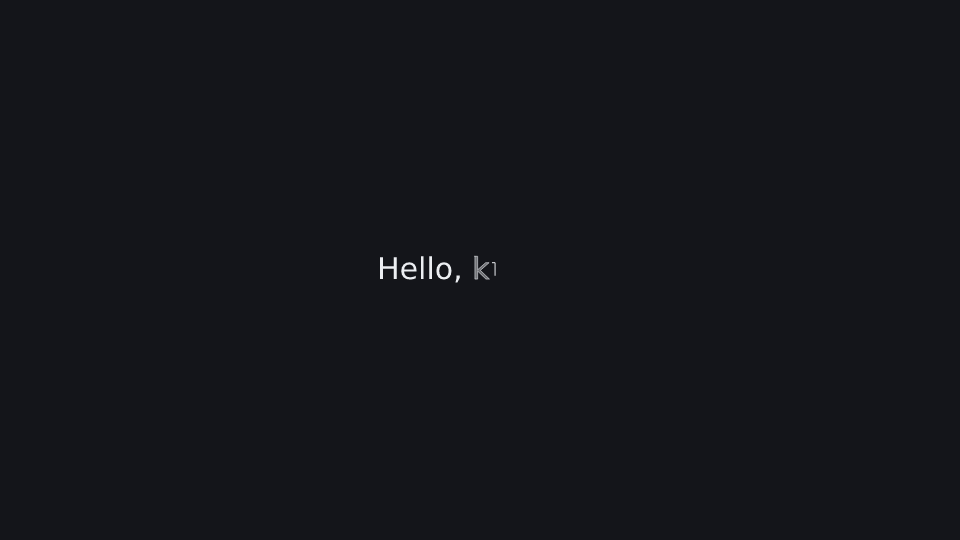
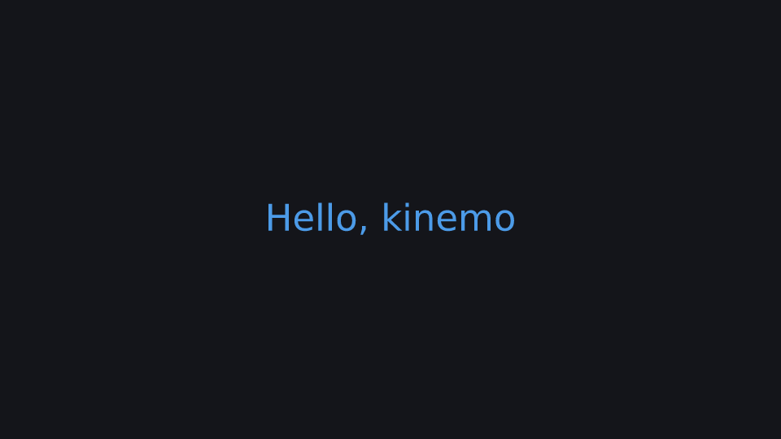

# Hello

The smallest scene: write a title, then animate its color and scale.

**Uses:** `k.Text`, `k.write`, `Node.to` — see the [API reference](../reference/README.md).

 

Run it: `kinemo dev examples/hello.py` · render: `kinemo render examples/hello.py`

```python
import kinemo as k


@k.scene(size="1080p", fps=60, background=k.theme.bg, seed=0, tail=0.5)
def hello(s: k.Scene):
    title = k.Text("Hello, kinemo").place(at="center")
    s.play(k.write(title))
    s.play(title.to(color=k.BLUE, scale=1.5))
    s.wait(1)
```
