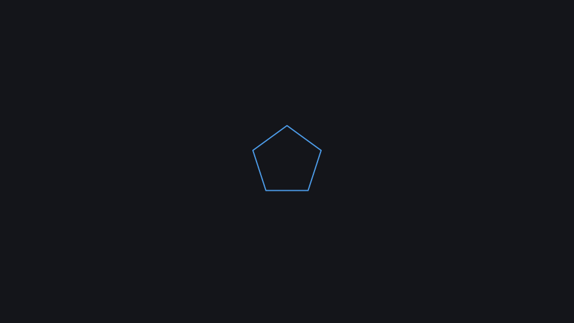

# Parametric polygon

A scene parameter drives the number of sides (`kinemo render --param n=8`).

**Uses:** `k.Int`, `k.Choice`, `Polygon.regular` — see the [API reference](../reference/README.md).



Run it: `kinemo dev examples/polygon.py` · render: `kinemo render examples/polygon.py`

```python
import kinemo as k


@k.scene(params={"n": k.Int(3, 12, default=5), "color": k.Choice([k.BLUE, k.RED])})
def polygon(s: k.Scene, n: k.Signal[float], color: k.Signal[k.Color]):
    s.play(k.draw(k.Polygon.regular(n, color=color)))
```
