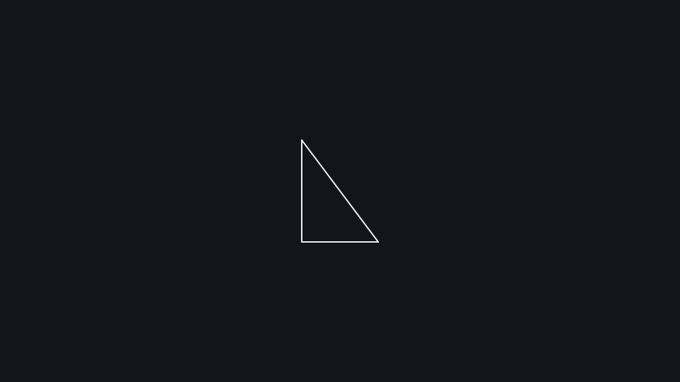
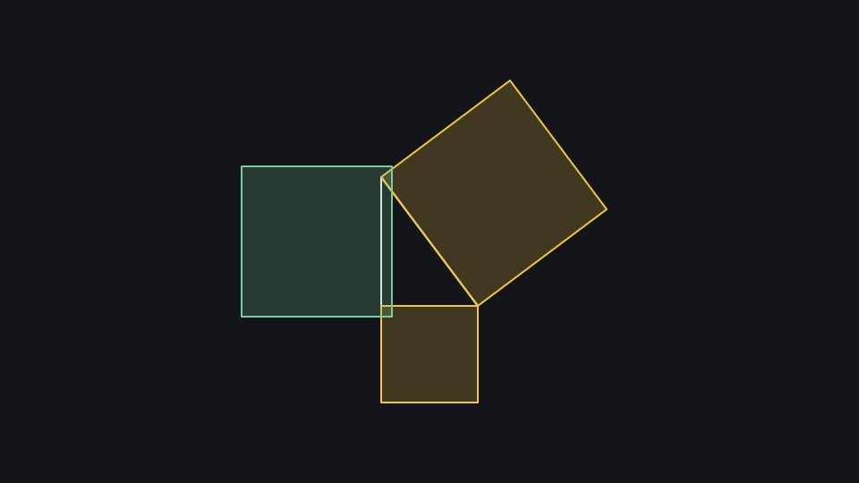
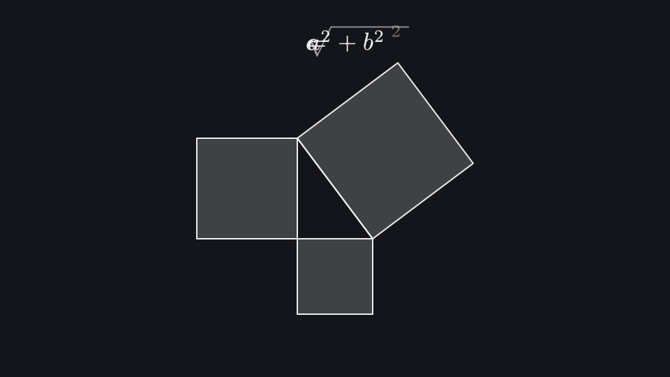

# Pythagoras

Squares built on the sides of a right triangle, a clip, a highlight with `s.during` and a structural morph between two equations.

**Uses:** `k.Triangle`, `Square.on`, `k.clip`, `k.Math`, `k.morph` — see the [API reference](../reference/README.md).

   

Run it: `kinemo dev examples/pythagoras.py` · render: `kinemo render examples/pythagoras.py`

```python
import kinemo as k


@k.clip
def squares(s: k.Scene, tri: k.Triangle) -> None:
    sq = [k.Square.on(side, outward=True, fill_opacity=0.2) for side in tri.sides]
    s.play(k.stagger([k.grow(q) for q in sq], lag=0.2))
    with s.during(sq[0].to(color=k.YELLOW), sq[1].to(color=k.YELLOW)):
        s.play(k.indicate(sq[2], color=k.GREEN))


@k.scene
def pythagoras(s: k.Scene):
    tri = k.Triangle.right(3, 4, scale=0.6).place(at="center")
    eq1 = k.Math(r"a^2 + b^2 = c^2").place(at="top", margin=0.6)
    eq2 = k.Math(r"c = \sqrt{a^2 + b^2}").place(at="top", margin=0.6)

    with s.voice("Every right triangle hides a relation between its sides."):  # kinemo: allow W1401
        s.play(k.draw(tri))
    s.play(squares(tri))
    s.play(k.write(eq1))
    s.mark(slide=True)                         # slide break
    s.play(k.morph(eq1, eq2))
    s.wait(1)
```
